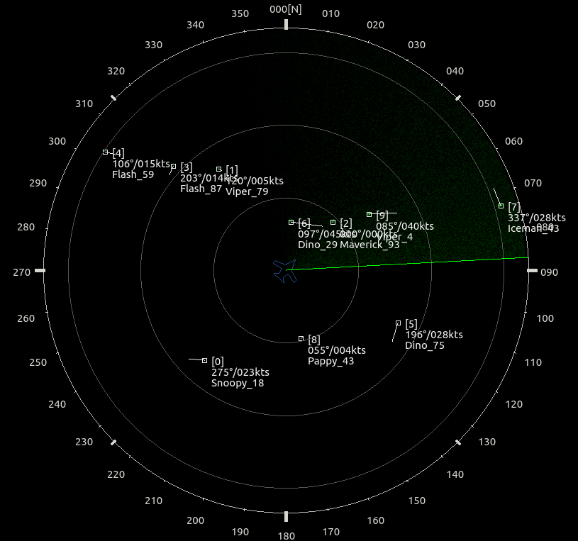

# RadarObelix
Something cool around RADAR display

The aim of the radar OBELIX environment is to provide simple tools (message protocol + API) for displaying a radar situation.

The radar OBELIX protocol is widely inspired of the real [ASTERIX protocol](https://en.wikipedia.org/wiki/ASTERIX_(ATC_standard) "Wikipedia page") but in a very simple way. It defines two kind of messages Video and Track sent over unicast UDP.
* Video messages allow to paint a PPI (Plane Plot Indicator)
* Track messages contains track properties

The radar OBELIX library includes different Qt/C++ classes for playing with the protocol. 
* Simulator (build and transmit messages)
* Plotter (receive and paint messages)
